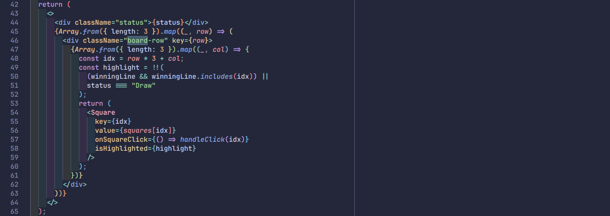
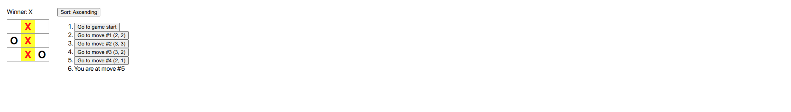
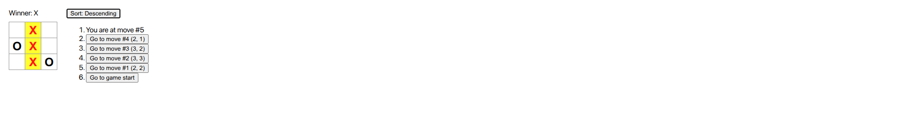
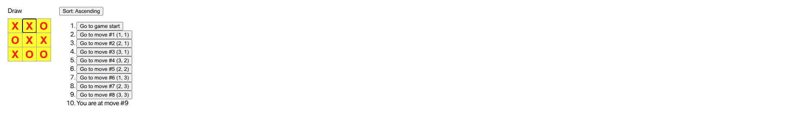

# IA01 - React Tic-Tac-Toe Game Enhancements

## Student info

- Name: Phan Thanh Tiến
- Student ID: 22120368

## Criterias

- Link: https://csc13114.onrender.com
- Self evaluate score: 10

| Feature                                                                                                                                    | Points |
| ------------------------------------------------------------------------------------------------------------------------------------------ | ------ |
| For the current move only, show “You are at move #…” instead of a button                                                                   | 1.8    |
| Rewrite the Board to use two loops to make the squares instead of hardcoding them                                                          | 1.8    |
| Add a toggle button that lets you sort the moves in either ascending or descending order                                                   | 1.8    |
| When someone wins, highlight the three squares that caused the win (and when no one wins, display a message about the result being a draw) | 1.8    |
| Display the location for each move in the format (row, col) in the move history list                                                       | 1.8    |
| Upload to a public host                                                                                                                    | 1.0    |

## Screenshots

- Rewrite the Board to use two loops to make the squares instead of hardcoding them
  

- Show current move, display coordinate, highlight winning line, ascending sort:
  

- Desending sort:
  

- Show draw message and highlight all squares when no one wins:
  
