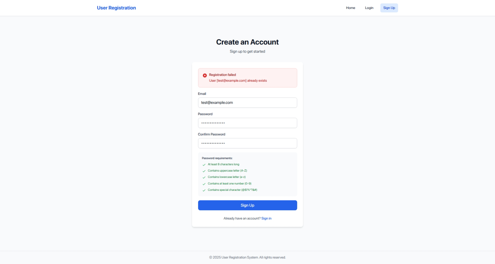
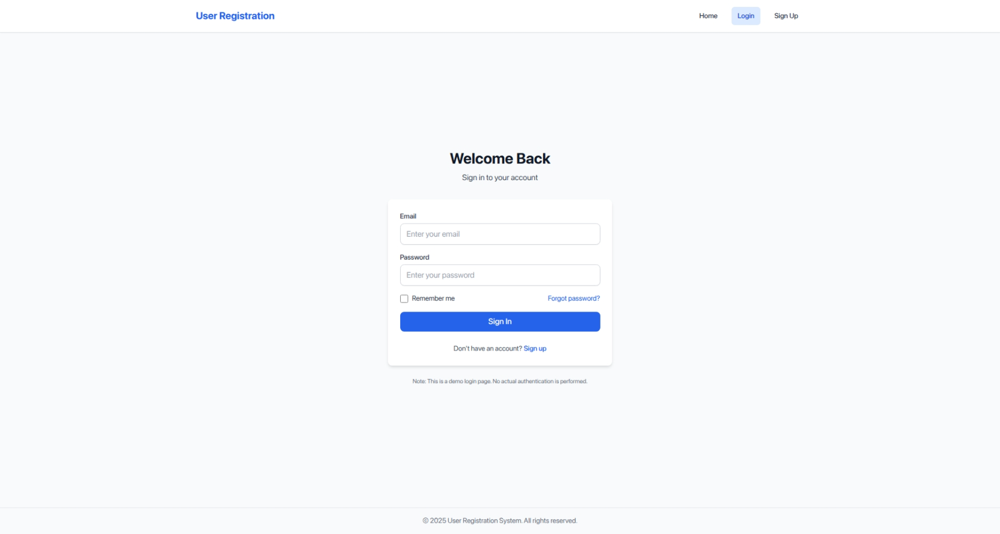
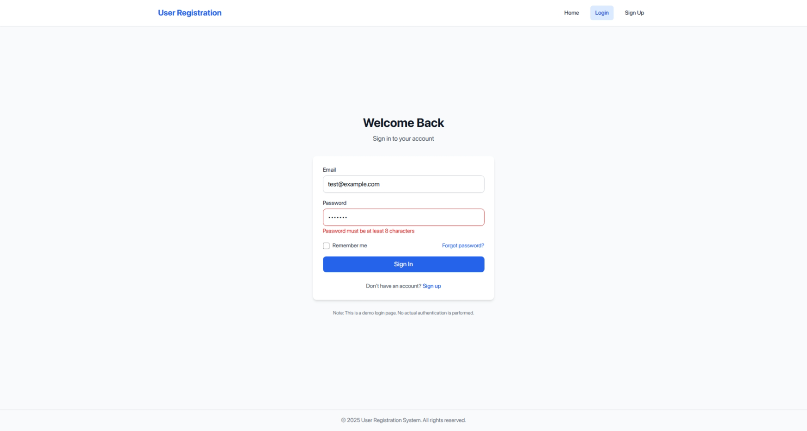
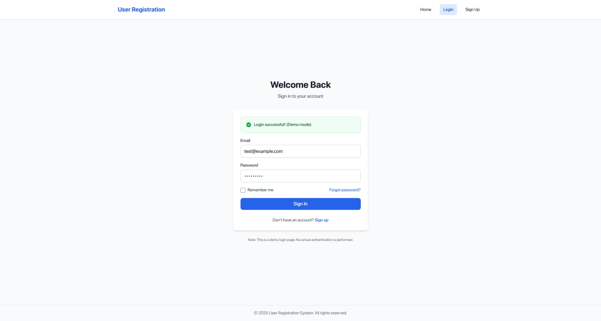
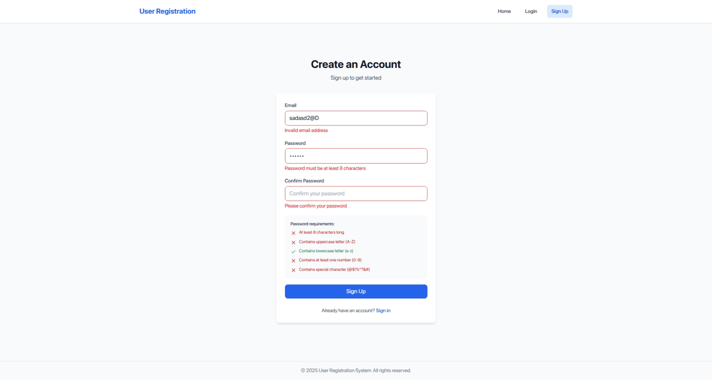

# IA03 - User Registration

## Student info

- Name: Phan Thanh Tiến
- Student ID: 22120368

## Criterias

- Link FE: https://csc13114-ia03-22120368-fe.onrender.com
- Link BE: https://csc13114-ia03-22120368-be.onrender.com
- Due to free plan, the backend server may be spun down. When access, it may take a minute to wake up.

- **Self evaluate score: 10**

| Feature                                                           | Points | Completeness |
| ----------------------------------------------------------------- | ------ | ------------ |
| API Endpoint (/register)                                          | 2      | 100%         |
| Error Handling                                                    | 2      | 100%         |
| Routing (Home, Login, Sign Up)                                    | 1      | 100%         |
| Sign Up Page (Form, Validation, API Integration with React Query) | 2      | 100%         |
| Login Page (Form, Validation, UI with shadcn/ui or equivalent)    | 2      | 100%         |
| Public host deployment                                            | 1      | 100%         |

## Screenshots

- Case failed to register due to existing email:
  

- If register successfully, it will redirect to the login page:
  

- Password length validation:
  

- Mock success response from backend:
  

- Sign up validation:
  
